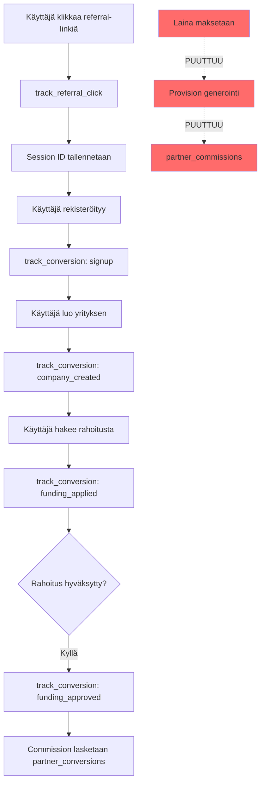

# 🤝 Partner & Referral System - Kattava Analyysi

**Päivämäärä:** 2025-01-11  
**Analyysin Laajuus:** Automaattinen liikevaihdon seuranta ja komissioiden hallinta

---

## 📋 Tiivistelmä

Järjestelmässä on **kattava referral-tracking- ja commission-järjestelmä**, mutta se vaatii **kriittisiä täydennyksiä** automaattisen liikevaihdon seurannan ja komissioiden generoinnin osalta.

### ✅ Toimii Hyvin
- Referral-linkkien luonti ja seuranta
- Click-tracking ja attribution
- Monipuolinen analytiikka ja raportointi
- Partner-dashboard

### ⚠️ Vaatii Kehitystä
- **Automaattinen komission generointi** kun laina maksetaan
- **Liikevaihdon linkitys** funding_applications → commissions
- **Webhook-integraatiot** lainanantajien kanssa
- **Scheduled job** provisioiden laskentaan
- **Maksuprosessi** kumppaneille

### 🚨 Kriittiset Riskit
- Provisioita ei generoida automaattisesti
- Ei suoraa yhteyttä "maksettu laina" → "provisio kumppanille"
- Manuaalinen prosessi altis virheille

---

## 🏗️ Nykyinen Arkkitehtuuri

### 1. Tietokantarakenne

```sql
partners (kumppanit)
├── id
├── name
├── email
├── commission_percent  ← Provision prosentti
├── status (active/inactive/suspended)
└── tier (basic/premium/enterprise)

partner_referral_links (referral-linkit)
├── id
├── partner_id
├── link_code           ← Uniikki koodi (esim. "PARTNER-HOME")
├── source_page
├── campaign_name
├── click_count         ← Cached
├── conversion_count    ← Cached
└── total_revenue       ← Cached

partner_referral_clicks (klikkaukset)
├── id
├── referral_link_id
├── partner_id
├── session_id          ← Attribution
├── fingerprint
├── device_info
└── attribution_expires_at

partner_conversions (konversiot)
├── id
├── partner_id
├── referral_click_id
├── company_id
├── user_id
├── conversion_type     ← signup, company_created, funding_applied, funding_approved
├── conversion_value
├── commission_rate
├── commission_amount   ← Laskettu, mutta EI linkitetty funding_applications
└── funnel_stage

partner_commissions (provisiot)
├── id
├── partner_id
├── company_id
├── agreement_id        ← FK funding_applications (nullable)
├── commission_amount
├── commission_percent
├── base_amount
├── status              ← pending, calculated, paid, cancelled
├── payment_date
└── payment_reference
```

### 2. Prosessikulku (Nykyinen)



---

## 🔍 Yksityiskohtainen Analyysi

### 1. ✅ Toimivat Ominaisuudet

#### A) Referral Tracking
**Sijainti:** `supabase/migrations/20250701183040_partner_referral_tracking_system.sql`

**Toiminnallisuus:**
- ✅ Referral-linkkien generointi per kumppani
- ✅ UTM-parametrien seuranta
- ✅ Click tracking device/browser/geo-datalla
- ✅ 30 päivän attribution window
- ✅ Session-based tracking
- ✅ Fingerprinting duplikaattien estoon

**Funktiot:**
```sql
-- Luo uniikin referral-linkin
generate_referral_link_code(p_partner_id, p_source_page, p_campaign_name)

-- Seuraa klikkausta
track_referral_click(p_link_code, p_session_id, p_fingerprint, ...)

-- Seuraa konversiota
track_conversion(p_session_id, p_conversion_type, p_conversion_value, ...)
```

**API Endpoints:**
- `POST /api/partners/[id]/referral-links` - Luo uusi linkki
- `GET /api/partners/[id]/referral-links` - Listaa linkit
- `POST /api/tracking/referral-click` - Tallenna klikkaus
- `POST /api/tracking/conversion` - Tallenna konversio

#### B) Analytics & Raportointi
**Sijainti:** `app/api/partners/[id]/analytics/route.ts`

**Metriikat:**
- ✅ Total clicks, conversions, revenue
- ✅ Conversion rate
- ✅ Time series data (daily)
- ✅ Top sources and campaigns
- ✅ Funnel analysis (awareness → retention)
- ✅ Geographic breakdown
- ✅ Device breakdown
- ✅ Top performing links

**Database Function:**
```sql
get_partner_analytics(p_partner_id, p_start_date, p_end_date)
→ Returns comprehensive JSON analytics
```

#### C) Partner Dashboard
**Sijainti:** `app/[locale]/partner/dashboard/page.tsx`

**Ominaisuudet:**
- ✅ Overview stats (revenue, commissions, companies)
- ✅ Referral links management
- ✅ Commission history
- ✅ Customer list
- ✅ Analytics visualization

---

### 2. ⚠️ Puuttuvat/Keskeneräiset Ominaisuudet

#### A) 🚨 KRIITTINEN: Automaattinen Komission Generointi

**Ongelma:**
```typescript
// partner_conversions sisältää lasketun commission_amount
// MUTTA tätä ei siirretä automaattisesti partner_commissions-tauluun!

// Nykyinen tila:
track_conversion() 
  → Laskee commission_amount partner_conversions-tauluun
  → ❌ EI luo riviä partner_commissions-tauluun

// Tulisi olla:
loan_disbursed webhook 
  → Päivitä funding_application status = 'disbursed'
  → Etsi liittyvä partner_conversion
  → ✅ Luo rivi partner_commissions-tauluun
```

**Mitä puuttuu:**
1. **Trigger/Function** joka luo commission-rivin kun laina maksetaan
2. **Webhook handler** joka kutsuu tätä funktiota
3. **Linkitys** funding_applications.id → partner_commissions.agreement_id

**Sijainti jossa pitäisi olla:**
```sql
-- ❌ PUUTTUU
CREATE OR REPLACE FUNCTION generate_commission_on_disbursement()
RETURNS TRIGGER AS $$
BEGIN
  -- When funding_application status changes to 'disbursed'
  -- Find related partner_conversion
  -- Create partner_commission record
END;
$$ LANGUAGE plpgsql;

CREATE TRIGGER on_loan_disbursed
  AFTER UPDATE ON funding_applications
  FOR EACH ROW
  WHEN (NEW.status = 'disbursed' AND OLD.status != 'disbursed')
  EXECUTE FUNCTION generate_commission_on_disbursement();
```

#### B) 🔴 Webhook-integraatiot Epätäydelliset

**Tila nyt:**
```typescript
// app/api/webhooks/capitalbox/route.ts
case 'loanDisbursed':
  await updateLenderApplicationStatusInDb(supabaseClient, reference, 'disbursed');
  // ❌ EI kutsu commission-generointia
  break;
```

**Mitä pitäisi tapahtua:**
```typescript
case 'loanDisbursed':
  // 1. Päivitä lender_application status
  await updateLenderApplicationStatusInDb(..., 'disbursed');
  
  // 2. Etsi funding_application
  const fundingApp = await getFundingApplication(lenderAppId);
  
  // 3. Päivitä funding_application status
  await updateFundingApplicationStatus(fundingApp.id, 'disbursed');
  
  // 4. ✅ Generoi provisio kumppanille
  await generatePartnerCommission(fundingApp);
  
  // 5. Lähetä notification kumppanille
  await notifyPartnerOfCommission(fundingApp.partner_id);
  break;
```

#### C) 🟡 Komissioiden Maksuprosessi

**Puuttuu kokonaan:**
1. **Bulk payment preparation** - Valitse maksettavat provisiot
2. **Payment export** - CSV/XML export pankkiin
3. **Payment reconciliation** - Merkitse maksetuksi
4. **Invoice generation** - Lasku kumppanille
5. **Payment notifications** - Email kumppanille

**API endpoints puuttuu:**
```typescript
// ❌ PUUTTUU
POST /api/admin/commissions/prepare-payment
POST /api/admin/commissions/export-payment
PATCH /api/admin/commissions/mark-paid
GET /api/admin/commissions/pending-payments
```

#### D) 🟡 Scheduled Jobs

**Puuttuu:**
```typescript
// ❌ PUUTTUU - Inngest function
export const calculateMonthlyCommissions = inngest.createFunction(
  { id: 'calculate-monthly-commissions', cron: '0 2 1 * *' }, // 1st of month 2 AM
  async () => {
    // 1. Hae kaikki 'disbursed' funding_applications ilman commission-riviä
    // 2. Luo partner_commissions rivit
    // 3. Lähetä yhteenveto admineille
  }
);

export const sendCommissionReports = inngest.createFunction(
  { id: 'send-commission-reports', cron: '0 9 1 * *' }, // 1st of month 9 AM
  async () => {
    // Lähetä kuukausiraportti jokaiselle kumppanille
  }
);
```

---

## 🎯 Kehitysehdotukset Prioriteettijärjestyksessä

### 🔥 Prioriteetti 1: KRIITTINEN (Tarvitaan välittömästi)

#### 1.1. Automaattinen Komission Generointi

**Tavoite:** Kun laina maksetaan, provisio generoidaan automaattisesti kumppanille.

**Toteutus:**

```sql
-- File: supabase/migrations/YYYYMMDD_auto_commission_generation.sql

-- Function: Generate partner commission when loan is disbursed
CREATE OR REPLACE FUNCTION generate_partner_commission_on_disbursement()
RETURNS TRIGGER AS $$
DECLARE
  v_company_id uuid;
  v_partner_id uuid;
  v_conversion record;
  v_commission_id uuid;
BEGIN
  -- Only process if status changed to 'disbursed'
  IF NEW.status = 'disbursed' AND OLD.status != 'disbursed' THEN
    
    -- Get company_id from funding_application
    v_company_id := NEW.company_id;
    
    -- Get partner_id from company
    SELECT partner_id INTO v_partner_id
    FROM public.companies
    WHERE id = v_company_id;
    
    -- If no partner, exit
    IF v_partner_id IS NULL THEN
      RAISE NOTICE 'No partner associated with company %, skipping commission', v_company_id;
      RETURN NEW;
    END IF;
    
    -- Find the most recent 'funding_approved' conversion for this company
    SELECT * INTO v_conversion
    FROM public.partner_conversions
    WHERE company_id = v_company_id
      AND partner_id = v_partner_id
      AND conversion_type = 'funding_approved'
      AND commission_eligible = true
    ORDER BY converted_at DESC
    LIMIT 1;
    
    IF v_conversion IS NULL THEN
      RAISE NOTICE 'No eligible conversion found for company % and partner %', v_company_id, v_partner_id;
      RETURN NEW;
    END IF;
    
    -- Check if commission already exists
    IF EXISTS (
      SELECT 1 FROM public.partner_commissions
      WHERE partner_id = v_partner_id
        AND company_id = v_company_id
        AND agreement_id = NEW.id
    ) THEN
      RAISE NOTICE 'Commission already exists for application %, skipping', NEW.id;
      RETURN NEW;
    END IF;
    
    -- Calculate commission
    -- Use actual disbursed amount, not the conversion_value
    DECLARE
      v_commission_percent numeric;
      v_commission_amount numeric;
    BEGIN
      SELECT commission_percent INTO v_commission_percent
      FROM public.partners
      WHERE id = v_partner_id;
      
      v_commission_amount := NEW.amount * (v_commission_percent / 100);
      
      -- Create partner_commission record
      INSERT INTO public.partner_commissions (
        partner_id,
        company_id,
        agreement_id,
        commission_amount,
        commission_percent,
        base_amount,
        currency,
        status,
        generated_at,
        metadata
      ) VALUES (
        v_partner_id,
        v_company_id,
        NEW.id,
        v_commission_amount,
        v_commission_percent,
        NEW.amount,
        NEW.currency,
        'calculated', -- Status: calculated, ready for payment processing
        now(),
        jsonb_build_object(
          'conversion_id', v_conversion.id,
          'conversion_type', v_conversion.conversion_type,
          'referral_link_id', v_conversion.referral_link_id,
          'disbursed_at', NEW.updated_at
        )
      ) RETURNING id INTO v_commission_id;
      
      RAISE NOTICE 'Created commission % for partner % - Amount: % %', 
        v_commission_id, v_partner_id, v_commission_amount, NEW.currency;
    END;
    
  END IF;
  
  RETURN NEW;
END;
$$ LANGUAGE plpgsql SECURITY DEFINER;

-- Trigger: Auto-generate commission on loan disbursement
CREATE TRIGGER auto_generate_partner_commission
  AFTER UPDATE ON public.funding_applications
  FOR EACH ROW
  EXECUTE FUNCTION generate_partner_commission_on_disbursement();

COMMENT ON FUNCTION generate_partner_commission_on_disbursement() IS 
  'Automatically generates partner commission when a funding application status changes to disbursed';
```

**Testaus:**
```sql
-- Test case 1: Update funding_application to disbursed
UPDATE funding_applications
SET status = 'disbursed'
WHERE id = '<test_application_id>';

-- Verify commission was created
SELECT * FROM partner_commissions
WHERE agreement_id = '<test_application_id>';
```

**Hyödyt:**
- ✅ Täysin automaattinen
- ✅ Ei vaadi manuaalista interventiota
- ✅ Toimii kaikille lainanantajille (webhook-riippumaton)
- ✅ Audit trail metadata-kentässä

---

#### 1.2. Webhook-integraation Päivitys

**Tavoite:** Varmistaa että loanDisbursed-webhook päivittää funding_application statuksen.

**Toteutus:**

```typescript
// File: app/api/webhooks/capitalbox/route.ts

case 'loanDisbursed':
  console.log(`Processing loanDisbursed event for UUID: ${lenderApplicationReference}`);
  
  // 1. Update lender_application status
  await updateLenderApplicationStatusInDb(
    supabaseClient, 
    lenderApplicationReference, 
    'disbursed'
  );
  
  // 2. Find and update funding_application
  const { data: lenderApp } = await supabaseClient
    .from('lender_applications')
    .select('application_id, lender_id')
    .eq('lender_application_id', lenderApplicationReference)
    .single();
  
  if (lenderApp?.application_id) {
    // Update funding_application status
    // This will trigger the auto_generate_partner_commission trigger!
    const { error: updateError } = await supabaseClient
      .from('funding_applications')
      .update({ 
        status: 'disbursed',
        updated_at: new Date().toISOString()
      })
      .eq('id', lenderApp.application_id);
    
    if (updateError) {
      console.error(`Failed to update funding_application ${lenderApp.application_id}:`, updateError);
    } else {
      console.log(`✅ Updated funding_application ${lenderApp.application_id} to disbursed`);
      // Commission will be auto-generated by trigger
    }
  }
  
  break;
```

**Testaus:**
```bash
# Send test webhook
curl -X POST https://your-app.com/api/webhooks/capitalbox \
  -H "Content-Type: application/json" \
  -d '{
    "eventType": "loanDisbursed",
    "uuid": "<test_lender_app_id>",
    "payload": {
      "disbursementAmount": 50000,
      "disbursementDate": "2025-01-11"
    }
  }'
```

---

### 🔶 Prioriteetti 2: TÄRKEÄ (Seuraavat 2 viikkoa)

#### 2.1. Komissioiden Maksuprosessi

**Tavoite:** Hallinnoi provisioiden maksaminen kumppaneille.

**Toteutus:**

**A) Admin API Endpoints:**

```typescript
// File: app/api/admin/commissions/pending/route.ts

export async function GET(request: NextRequest) {
  // Auth check: Admin only
  
  const url = new URL(request.url);
  const status = url.searchParams.get('status') || 'calculated';
  const partnerId = url.searchParams.get('partner_id');
  
  let query = supabase
    .from('partner_commissions')
    .select(`
      *,
      partner:partners(id, name, email),
      company:companies(id, name, business_id),
      agreement:funding_applications(id, amount)
    `)
    .eq('status', status)
    .order('generated_at', { ascending: false });
  
  if (partnerId) {
    query = query.eq('partner_id', partnerId);
  }
  
  const { data, error } = await query;
  
  // Calculate totals
  const totalAmount = data?.reduce((sum, c) => sum + parseFloat(c.commission_amount), 0) || 0;
  const totalCount = data?.length || 0;
  
  // Group by partner
  const byPartner = data?.reduce((acc, commission) => {
    const partnerId = commission.partner_id;
    if (!acc[partnerId]) {
      acc[partnerId] = {
        partner: commission.partner,
        commissions: [],
        total: 0
      };
    }
    acc[partnerId].commissions.push(commission);
    acc[partnerId].total += parseFloat(commission.commission_amount);
    return acc;
  }, {} as Record<string, any>);
  
  return NextResponse.json({
    commissions: data,
    summary: {
      total_amount: totalAmount,
      total_count: totalCount,
      by_partner: Object.values(byPartner || {})
    }
  });
}
```

**B) Bulk Payment Marking:**

```typescript
// File: app/api/admin/commissions/mark-paid/route.ts

export async function POST(request: NextRequest) {
  // Auth check: Admin only
  
  const body = await request.json();
  const { commission_ids, payment_reference, payment_date, notes } = body;
  
  // Validate
  if (!commission_ids || !Array.isArray(commission_ids) || commission_ids.length === 0) {
    return NextResponse.json({ error: 'commission_ids required' }, { status: 400 });
  }
  
  const { data, error } = await supabase
    .from('partner_commissions')
    .update({
      status: 'paid',
      paid_at: payment_date || new Date().toISOString(),
      payment_date: payment_date || new Date().toISOString(),
      payment_reference: payment_reference,
      notes: notes
    })
    .in('id', commission_ids)
    .select();
  
  if (error) {
    return NextResponse.json({ error: error.message }, { status: 500 });
  }
  
  // Log audit event
  await supabase.from('partner_audit_log').insert({
    action: 'commissions_marked_paid',
    performed_by: user.id,
    details: {
      commission_ids,
      payment_reference,
      count: data.length,
      total_amount: data.reduce((sum, c) => sum + c.commission_amount, 0)
    }
  });
  
  // TODO: Send email notifications to partners
  
  return NextResponse.json({ 
    success: true,
    updated_count: data.length,
    commissions: data
  });
}
```

**C) Payment Export (CSV):**

```typescript
// File: app/api/admin/commissions/export-payment/route.ts

export async function POST(request: NextRequest) {
  // Auth check: Admin only
  
  const body = await request.json();
  const { commission_ids, format = 'csv' } = body;
  
  const { data: commissions } = await supabase
    .from('partner_commissions')
    .select(`
      *,
      partner:partners(name, email, metadata)
    `)
    .in('id', commission_ids);
  
  if (format === 'csv') {
    const csv = [
      ['Partner Name', 'Email', 'IBAN', 'Amount', 'Currency', 'Reference', 'Commission ID'].join(','),
      ...commissions.map(c => [
        c.partner.name,
        c.partner.email,
        c.partner.metadata?.iban || '',
        c.commission_amount,
        c.currency,
        `COMMISSION-${c.id.substring(0, 8)}`,
        c.id
      ].join(','))
    ].join('\n');
    
    return new NextResponse(csv, {
      headers: {
        'Content-Type': 'text/csv',
        'Content-Disposition': `attachment; filename="commissions_export_${Date.now()}.csv"`
      }
    });
  }
  
  // TODO: Support SEPA XML format for bank transfers
  
  return NextResponse.json({ error: 'Invalid format' }, { status: 400 });
}
```

**D) Partner Payment Info:**

```sql
-- Add payment info to partners table
ALTER TABLE public.partners 
ADD COLUMN IF NOT EXISTS bank_account_name text,
ADD COLUMN IF NOT EXISTS bank_iban text,
ADD COLUMN IF NOT EXISTS bank_bic text,
ADD COLUMN IF NOT EXISTS tax_id text,
ADD COLUMN IF NOT EXISTS invoice_address jsonb DEFAULT '{}';
```

---

#### 2.2. Scheduled Reporting Jobs

**Tavoite:** Automaattiset raportit kumppaneille ja admineille.

**Toteutus:**

```typescript
// File: lib/inngest/functions/partnerCommissions.ts

import { inngest } from '../inngest.client';
import { createClient } from '@/utils/supabase/server';

// Monthly commission report to partners
export const sendMonthlyCommissionReports = inngest.createFunction(
  { 
    id: 'send-monthly-commission-reports',
    cron: '0 9 1 * *' // 1st of month, 9 AM
  },
  async ({ step }) => {
    const supabase = await createClient(undefined, true);
    
    // Get all active partners
    const { data: partners } = await supabase
      .from('partners')
      .select('*')
      .eq('status', 'active');
    
    if (!partners || partners.length === 0) {
      return { message: 'No active partners found' };
    }
    
    const lastMonth = new Date();
    lastMonth.setMonth(lastMonth.getMonth() - 1);
    const startOfMonth = new Date(lastMonth.getFullYear(), lastMonth.getMonth(), 1);
    const endOfMonth = new Date(lastMonth.getFullYear(), lastMonth.getMonth() + 1, 0);
    
    const results = [];
    
    for (const partner of partners) {
      // Get month's commissions
      const { data: commissions } = await supabase
        .from('partner_commissions')
        .select(`
          *,
          company:companies(name),
          agreement:funding_applications(amount)
        `)
        .eq('partner_id', partner.id)
        .gte('generated_at', startOfMonth.toISOString())
        .lte('generated_at', endOfMonth.toISOString());
      
      if (!commissions || commissions.length === 0) {
        continue;
      }
      
      const totalCommission = commissions.reduce((sum, c) => sum + parseFloat(c.commission_amount), 0);
      const paidCommission = commissions
        .filter(c => c.status === 'paid')
        .reduce((sum, c) => sum + parseFloat(c.commission_amount), 0);
      const pendingCommission = totalCommission - paidCommission;
      
      // Send email report
      await step.run(`send-email-${partner.id}`, async () => {
        // TODO: Implement email sending
        console.log(`Sending monthly report to ${partner.email}:`, {
          totalCommission,
          paidCommission,
          pendingCommission,
          commissionCount: commissions.length
        });
        
        return { sent: true, partnerId: partner.id };
      });
      
      results.push({
        partnerId: partner.id,
        partnerName: partner.name,
        totalCommission,
        commissionCount: commissions.length
      });
    }
    
    return { 
      message: `Sent ${results.length} monthly reports`,
      results 
    };
  }
);

// Reconcile orphaned conversions (conversions without commissions)
export const reconcileOrphanedConversions = inngest.createFunction(
  {
    id: 'reconcile-orphaned-conversions',
    cron: '0 3 * * *' // Daily at 3 AM
  },
  async ({ step }) => {
    const supabase = await createClient(undefined, true);
    
    // Find 'funding_approved' conversions without matching commissions
    const { data: orphanedConversions } = await supabase
      .from('partner_conversions')
      .select(`
        *,
        company:companies(partner_id)
      `)
      .eq('conversion_type', 'funding_approved')
      .eq('commission_eligible', true)
      .is('commission_amount', null); // Conversions with no commission calculated
    
    // Find disbursed funding_applications without commissions
    const { data: disbursedApps } = await supabase
      .from('funding_applications')
      .select(`
        id,
        company_id,
        amount,
        currency,
        companies!inner(partner_id)
      `)
      .eq('status', 'disbursed')
      .not('companies.partner_id', 'is', null);
    
    const missing = [];
    
    if (disbursedApps) {
      for (const app of disbursedApps) {
        // Check if commission exists
        const { data: existingCommission } = await supabase
          .from('partner_commissions')
          .select('id')
          .eq('agreement_id', app.id)
          .maybeSingle();
        
        if (!existingCommission) {
          missing.push(app);
        }
      }
    }
    
    if (missing.length > 0) {
      // Log missing commissions for admin review
      console.warn(`Found ${missing.length} disbursed applications without commissions:`, missing);
      
      // TODO: Send alert to admins
      // TODO: Auto-generate commissions?
    }
    
    return {
      orphanedConversions: orphanedConversions?.length || 0,
      missingCommissions: missing.length,
      details: missing
    };
  }
);
```

---

### 🟢 Prioriteetti 3: HYVÄ LISÄ (Seuraavat 4 viikkoa)

#### 3.1. Enhanced Reporting Dashboard

**Admin Dashboard:**
- Commission pipeline (calculated → approved → paid)
- Partner performance leaderboard
- Monthly/Quarterly reports
- Export to Excel with charts

**Partner Dashboard:**
- Real-time commission status
- Payment history
- Detailed conversion funnel
- Referral link performance A/B testing

#### 3.2. Commission Rules Engine

**Tavoite:** Joustavampi provision-laskenta.

```sql
CREATE TABLE public.partner_commission_rules (
  id uuid PRIMARY KEY DEFAULT gen_random_uuid(),
  partner_id uuid REFERENCES public.partners(id),
  funding_type text, -- 'business_loan', 'factoring', 'credit_line', 'leasing'
  min_amount numeric,
  max_amount numeric,
  commission_percent numeric(5,2),
  flat_fee numeric(12,2),
  priority integer DEFAULT 0,
  is_active boolean DEFAULT true,
  valid_from timestamptz DEFAULT now(),
  valid_until timestamptz,
  metadata jsonb DEFAULT '{}'
);

-- Example rules:
-- For loans < 50k: 3%
-- For loans 50k-200k: 2.5%
-- For loans > 200k: 2%
-- Factoring: Flat €500 per deal
```

#### 3.3. Partner Notifications

**Email Templates:**
- New commission generated
- Payment processed
- Monthly statement
- Performance milestones

**Implementation:**
```typescript
// lib/emails/partnerEmails.ts

export async function sendCommissionGeneratedEmail(
  partner: Partner,
  commission: PartnerCommission
) {
  // Use Resend or similar
  await resend.emails.send({
    to: partner.email,
    subject: `Uusi provisio generoi tu: €${commission.commission_amount}`,
    html: `
      <h1>Hyvää päivää ${partner.name}!</h1>
      <p>Olemme luoneet uuden provision tililläsi:</p>
      <ul>
        <li>Summa: €${commission.commission_amount}</li>
        <li>Yritys: ${commission.company.name}</li>
        <li>Rahoitus: €${commission.base_amount}</li>
        <li>Provision %: ${commission.commission_percent}%</li>
      </ul>
      <p>Provisio maksetaan seuraavan kuukauden maksuajossa.</p>
    `
  });
}
```

---

## 🚨 Tunnistetut Riskit ja Ratkaisut

### Riski 1: Duplikaatti Provisiot
**Ongelma:** Jos trigger ajetaan useita kertoja, voi syntyä duplikaatteja.

**Ratkaisu:**
```sql
-- Trigger-funktiossa:
IF EXISTS (
  SELECT 1 FROM public.partner_commissions
  WHERE partner_id = v_partner_id
    AND company_id = v_company_id
    AND agreement_id = NEW.id
) THEN
  RAISE NOTICE 'Commission already exists, skipping';
  RETURN NEW;
END IF;
```

### Riski 2: Väärä Komissio-% 
**Ongelma:** Kumppanin provision % muuttuu, vanha konversio saa uuden %.

**Ratkaisu:**
- Tallenna `commission_percent` partner_conversions-tauluun konversion aikana
- Käytä tuota arvoa, älä partners-taulun nykyistä %

**Fix:**
```sql
-- partner_conversions jo sisältää commission_rate
-- Käytä sitä eikä partners.commission_percent

-- Trigger-funktiossa:
v_commission_percent := v_conversion.commission_rate; -- ✅ Oikein
-- ÄLID: v_commission_percent := (SELECT commission_percent FROM partners ...) -- ❌ Väärin
```

### Riski 3: Conversion ilman Partner-yhteyttä
**Ongelma:** Yritys poistetaan kumppanilta ennen lainan maksamista.

**Ratkaisu:**
```sql
-- Säilytä partner_id partner_conversions-taulussa
-- Vaikka companies.partner_id muuttuisi, conversion säilyy

-- Trigger-funktiossa:
-- Etsi partner_id ENSIN partner_conversions-taulusta
SELECT partner_id INTO v_partner_id
FROM public.partner_conversions
WHERE company_id = v_company_id
  AND conversion_type = 'funding_approved'
ORDER BY converted_at DESC
LIMIT 1;

-- Jos ei löydy, SITTEN companies-taulusta
IF v_partner_id IS NULL THEN
  SELECT partner_id INTO v_partner_id
  FROM public.companies
  WHERE id = v_company_id;
END IF;
```

### Riski 4: Webhook Epäonnistuu
**Ongelma:** loanDisbursed webhook ei tule perille → provisio ei generoidu.

**Ratkaisu:**
1. **Primary:** Scheduled job joka tarkistaa orphaned applications
2. **Secondary:** Manual admin action: "Generate Missing Commissions"

```typescript
// Scheduled job (jo ehdotettu ylhäällä)
export const reconcileOrphanedConversions = ...

// Manual admin endpoint:
POST /api/admin/commissions/generate-missing
```

---

## 📊 Metriikat ja Seuranta

### KPI:t Järjestelmälle

**Toiminnalliset:**
- Commission generation success rate (tavoite: >99%)
- Average time from disbursement to commission generation (tavoite: <1min)
- Orphaned conversions (tavoite: 0)
- Duplicate commissions (tavoite: 0)

**Liiketoiminta:**
- Total commissions per month
- Average commission per partner
- Conversion rate by partner
- Revenue attributed to partners
- Commission-to-revenue ratio

### Monitoring & Alerting

**Implement:**
```typescript
// Supabase Edge Function or Inngest
export const monitorCommissionGeneration = inngest.createFunction(
  { id: 'monitor-commission-generation', cron: '0 */4 * * *' }, // Every 4 hours
  async () => {
    // Check for funding_applications disbursed > 1 hour ago without commissions
    const { data: missing } = await supabase
      .from('funding_applications')
      .select(`
        id,
        company_id,
        updated_at,
        companies!inner(partner_id)
      `)
      .eq('status', 'disbursed')
      .not('companies.partner_id', 'is', null)
      .lt('updated_at', new Date(Date.now() - 3600000).toISOString()); // 1 hour ago
    
    const missingCommissions = [];
    
    for (const app of missing || []) {
      const { data: commission } = await supabase
        .from('partner_commissions')
        .select('id')
        .eq('agreement_id', app.id)
        .maybeSingle();
      
      if (!commission) {
        missingCommissions.push(app);
      }
    }
    
    if (missingCommissions.length > 0) {
      // Send alert to admins
      await sendAlertEmail({
        subject: `⚠️ Missing Commissions Detected: ${missingCommissions.length}`,
        body: `Found ${missingCommissions.length} disbursed applications without commissions:
               ${JSON.stringify(missingCommissions, null, 2)}`
      });
    }
    
    return { missingCount: missingCommissions.length };
  }
);
```

---

## 🎯 Toteutussuunnitelma

### Viikko 1: Kriittiset Korjaukset
- ✅ Luo `generate_partner_commission_on_disbursement()` trigger
- ✅ Päivitä webhook-handlerit
- ✅ Testaa end-to-end flow dev-ympäristössä
- ✅ Deploy production

### Viikko 2: Maksuprosessi
- ✅ Luo admin API endpoints (pending, mark-paid, export)
- ✅ Lisää payment info partners-tauluun
- ✅ Admin UI komissioiden hallintaan
- ✅ Testaa payment flow

### Viikko 3: Scheduled Jobs
- ✅ Luo Inngest functions (monthly reports, reconciliation)
- ✅ Email templates kumppaneille
- ✅ Monitoring & alerting
- ✅ Testaa scheduled jobs

### Viikko 4: Viimeistely & Dokumentointi
- ✅ Partner dashboard päivitykset (payment history)
- ✅ Admin dokumentaatio
- ✅ Partner dokumentaatio
- ✅ Load testing

---

## 📝 Yhteenveto: Mitä Pitää Tehdä

### ✅ Toimii Nyt
1. Referral tracking (clicks, conversions)
2. Analytics & reporting
3. Partner dashboard basics
4. Commission calculation in partner_conversions

### ⚠️ Puuttuu
1. **Automaattinen provision generointi** (KRIITTINEN)
2. **Webhook → funding_application → commission** linkki
3. **Maksuprosessi** admineille
4. **Scheduled reporting** kumppaneille
5. **Monitoring & alerting**

### 🎯 Prioriteetit
1. **HETI:** Trigger-funktio provision generointiin
2. **VIIKKO 1:** Webhook-integraation korjaus
3. **VIIKKO 2:** Maksuprosessi
4. **VIIKKO 3:** Automatisointi ja raportointi

### 💡 Suositukset
- Aloita trigger-funktion toteutuksella → suurin vaikutus
- Testaa huolellisesti dev-ympäristössä ennen productionia
- Luo manual fallback-prosessi (admin action) hätätilanteisiin
- Implementoi monitoring heti alusta alkaen
- Dokumentoi prosessi kumppaneille

---

**Analyysi valmis!** 🎉

Järjestelmä on 70% valmis. Keskeinen puute on automaattinen komission generointi, joka voidaan korjata yhdellä trigger-funktiolla ja webhook-päivityksellä. Loput ovat "nice-to-have" ominaisuuksia jotka parantavat käyttökokemusta mutta eivät ole kriittisiä toiminnallisuuden kannalta.

---

*Dokumentti päivitetty: 2025-01-11*  
*Seuraava katselmointi: 2025-02-11*

